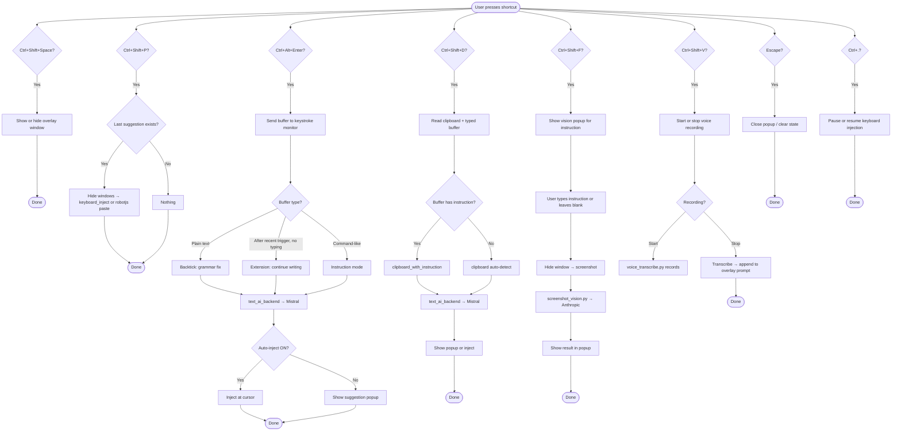
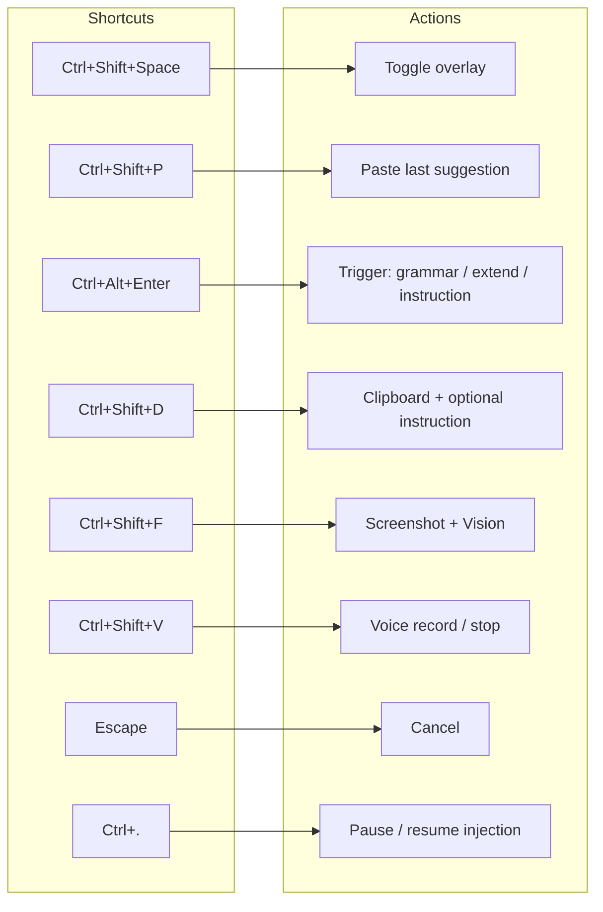
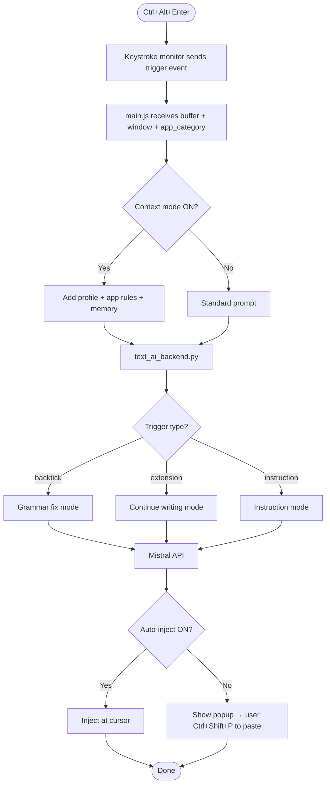

# AI Text Bot — Shortcuts Flowchart

## Main flowchart: User presses shortcut → outcome



---

## Simplified: Shortcut → Action (one line each)



---

## Trigger flow (Ctrl+Alt+Enter) detail



---

## Viewing the flowcharts

- **GitHub / GitLab:** Open this `.md` file; Mermaid diagrams render automatically.
- **VS Code:** Install "Markdown Preview Mermaid Support" and preview the file.
- **Online:** Copy the ` ```mermaid ` blocks into [mermaid.live](https://mermaid.live) to edit or export as PNG/SVG.
